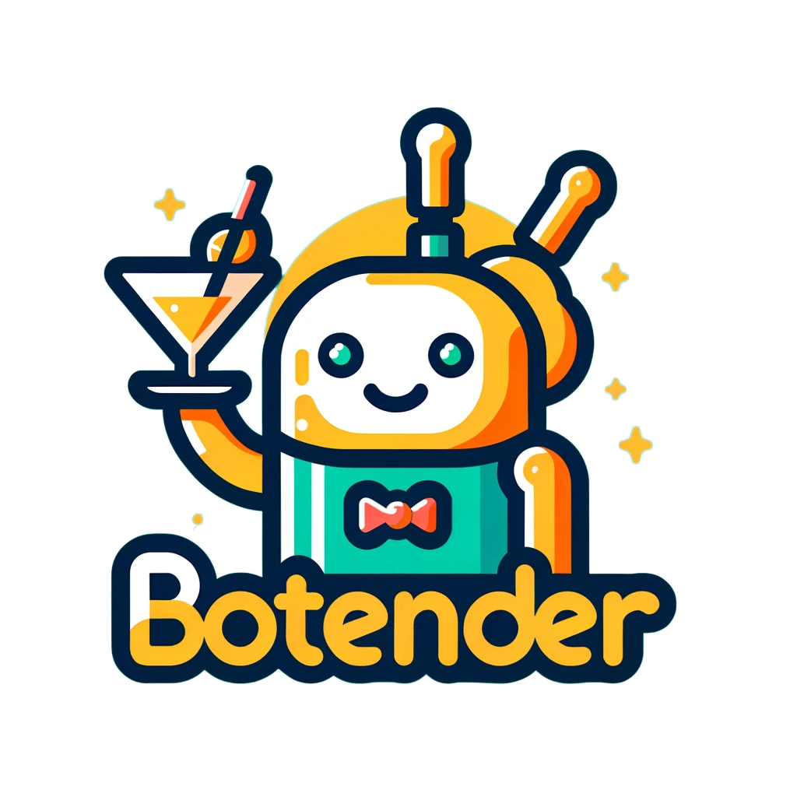
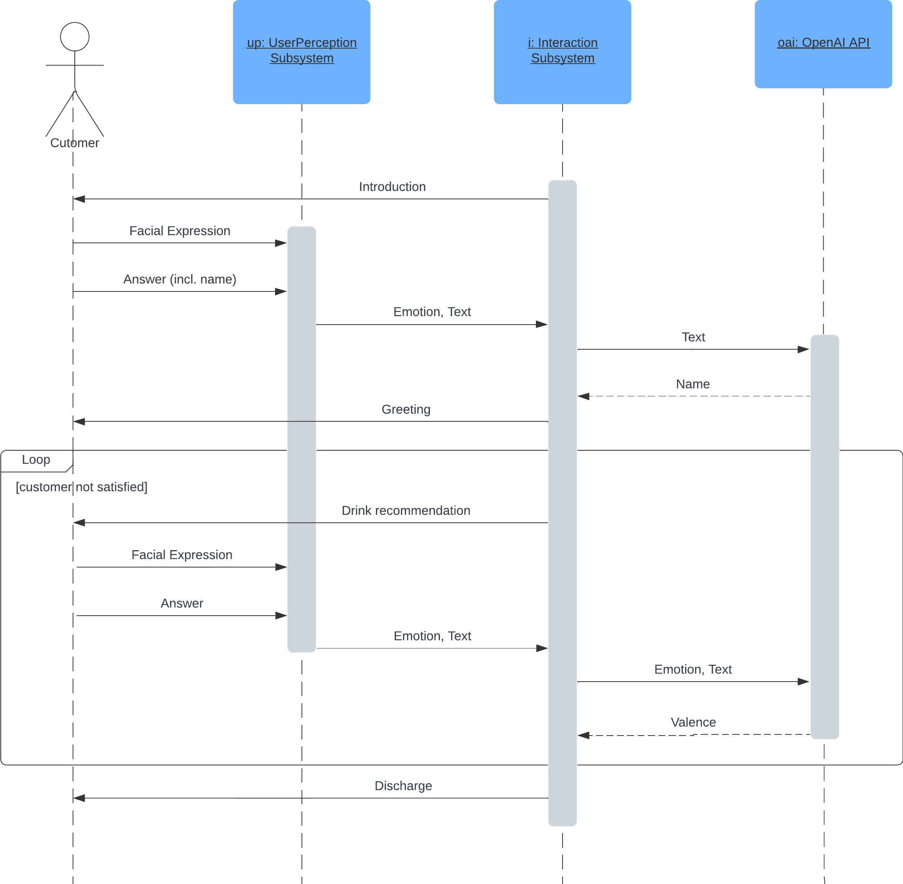
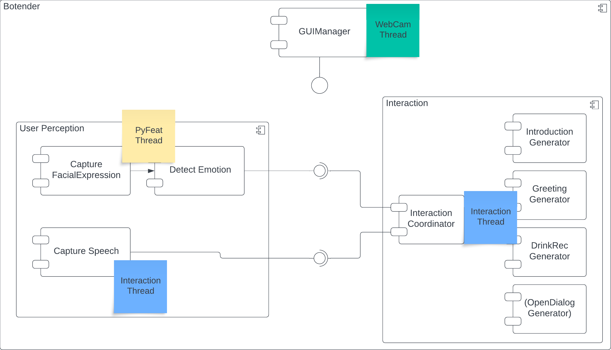
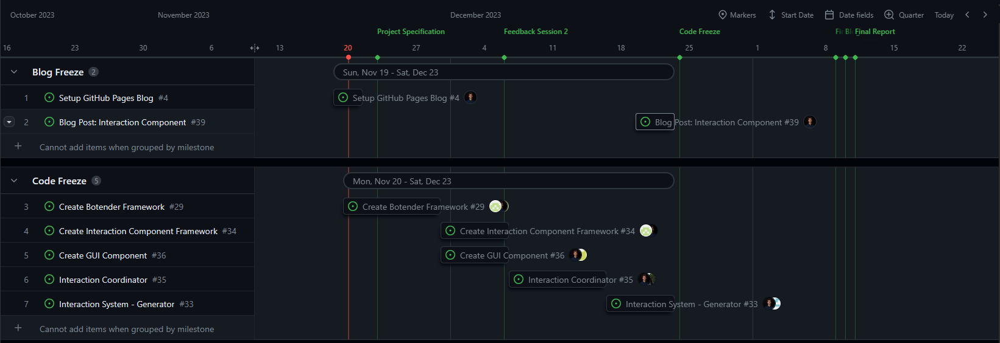
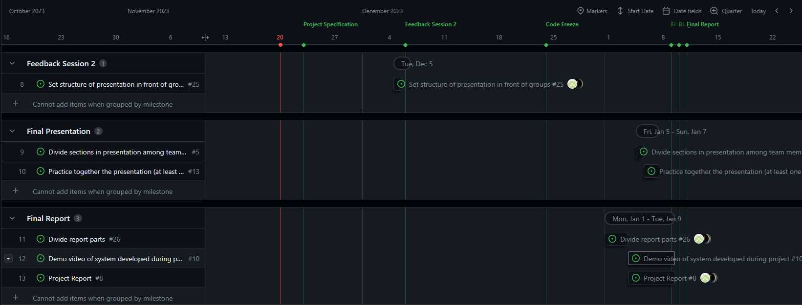
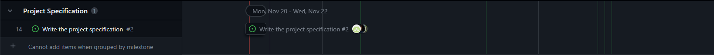

# Botender - Blog
An intelligent interactive social robot to order drinks from. Created for a Furhat Robot.

## Authors
Till Grutschus, Teodora Ljubevska, Lasse Frommelt, Raoul Dankert, Jurek Sander
## Scope
With Botender we want to create a social robot that can understand and adapt to the mood of the customer and recommend drinks accordingly.
This helps give customers the attention they deserve and personal recommendations for drinks, even if it's a busy night. 

This blog will describe and follow the planning and development phases of our project.
## Introduction
TODO

The goal of our first meeting was to create the specification document, which outlines the objectives of our project, alongside the resulting deliverables. We also identified possible future issues and stepping stones.
Lastly we began to structure all tasks into a timeline in order to gain an overview of the project.

In the following parts you can see the result of the specification meeting:
The Elevator Pitch captures the gist of our project in a oneliner.
The Objectives lay out what we want Botender to be able to accomplish when completed.
The Deliverables show the overarching, needed for the completion of the project.
The Potential Issues describe problems that my arise during the project.

### Elevator Pitch

Botender understands the mood of its human customers, engages in conversations based on facial expressions, and recommends the perfect drink for the occasion.

### Objectives

With Botender, we want to create a social robot that can understand and adapt to the mood of the customer and recommend drinks accordingly. This helps give customers the attention they deserve and personal recommendations for drinks, even if it's a busy night. Our concrete objectives are:

1. **Introduction**: Botender will be capable of introducing itself and asking for the customer's name.
2. **Understand the initial mood**: Botender can capture and classify facial expressions of a customer. Botender is capable of detecting at least four different emotions.
3. **React to the initial mood**: Botender can show compassion by reacting to the mood displayed. It will react in a minimum of four different ways.
4. **Give a drink recommendation**: Based on its understanding of the mood and situation, Botender can give recommendations for drinks.
5. **React to the customer's answer**: Botender can react to an answer that the customer gives after the drink recommendation. Botender is capable of differentiating between positive and negative reactions to its recommendation.

Aside from this choreographic interaction, we have the optional goal of making Botender either interact with multiple customers or engage in longer conversations with customers in need of an ear.

### Deliverables

Specific products which need to be delivered upon completion are:

1. A user perception subsystem written in Python that is capable of differentiating between a minimum of four emotions.
2. An interaction subsystem written in Python that uses the user's emotions and speech to hold a small conversation. It contains at least 16 custom gestures to react to a minimum of four different moods. Optionally, it contains a module for integrating OpenAI's language processing capabilities with Furhat to enable an open dialogue.
3. An overall system that contains both subsystems. The corresponding Python script can be executed in the console.
4. A video that shows the use case of interacting with Botender.
5. A report that describes the results and implementation of our project.
6. A blog created with GitHub pages to document the progress of our project.

### Success Metrics

In the following, we explain how we keep track of our progress:

1. **Interaction subsystem**: Is the system capable of asking for and understanding the customer's name?
2. **User perception subsystem**: Number of emotions that can be detected and detection accuracy.
3. **Interaction subsystem**: Number of gestures and reactions implemented for different situations.
4. **Interaction subsystem**: Is the system capable of giving a recommendation for a drink?
5. **Interaction subsystem**: Reliability of the system to understand the intention of responses to the drink recommendation.

### Potential Issues

As with any social robotics projects, potential ethical issues may arise at any point in the project and need to be considered. In addition to the simple task of text-to-speech translation, the system needs to be able to interpret spoken text and extract information, which can pose a technical challenge. Given that the whole interaction depends on the accuracy of the emotion classification of the user, an inaccurate first subsystem might cause problems throughout the whole system. Additionally, inferring the perfect drink for a customer might be difficult based on emotion detection on facial features alone, as the mood might be more nuanced than the system is capable of understanding. Finally, the perfect drink recommendation depends on the personal preferences of the customers.

## Control Flow & System Architecture
The goal of our second meeting was to define the control flow of our dialogue with Botender and the high-level system architecture. This was required to get a common understanding of our application and define the tasks accordingly.

The following diagram was the result of our brainstorming session and describes the communication between the customer, the two subsystems and the OpenAI API in the initial dialogue:

The dialogue contains three different phases:

1. Botender (Furhat) introduces himself and asks for the name of the customer
2. The customers answers with his name. The user perception subsystems captures additionally the facial expression of the customer and predicts his/her emotion. The user perception subsystem sends the emotion and converted answer to the interaction subsystem. This uses the OpenAI API to extract the name of the customer and greets him/her.
3. Botender recommends a drink based on the assumed mood of the customer. The interaction system gets the emotional and textual reaction to the recommended drink and evaluates if it is positive or negative. Botender recommends drinks until it gets a positive reaction or runs out of recommendations.

Optional, the dialogue can be extended with an open section. The interaction subsystem would then use the OpenAI API to create suitable answers.

After the definition of the control flow, we tried to define a system architecture that can realize the dialogue. We designed it such that it is modular and can be extended easily. The following diagram shows the high-level system architecture as a component diagram:

The Botender system consists of three subsystems:

1. The user perception subsystem contains three components that are responsible for capturing the facial expressions of the customer, using them to predict his/her emotions and capturing the speech of the customer. The components that capture the facial expressions and predicts the emotions are executed in the same thread ("PyFeat Thread"). The capture of the speech is done in a separate thread ("Interaction Thread") and uses the Furhat API to convert the speech to text.
2. The interaction subsystem uses the predicted emotion and the captured answer as input and controls the gestures and texts of Furhat. It runs therefore in the same thread like CaptureSpeech component of the user perception subsystem. The two threads ("PyFeat" and "Interaction Threads") share a global variable that stores the emotion of the customer. The interachtion subsystem contains the InteractionCoordinator component that is responsible for maintaining the dialogue structure. The generator components are capable of generating texts and gestures based on the input of the Interaction subsystem.
3. The GUIManager component is responsible of displaying the WebCam and its overlay. The overlay should contain at least the recognized faces, its predicted emotions and the recommended drink. It can be used for debugging and to make the video that shows a use case better understandable.

After this meeting, we had a common understanding of the control flow and the system architecture. We used this to define the main tasks for the whole project and set deadlines for them. The tasks are organised as GitHub issues and displayed in the project board of our GitHub repository. The following screenshot shows the project board after the meeting:

