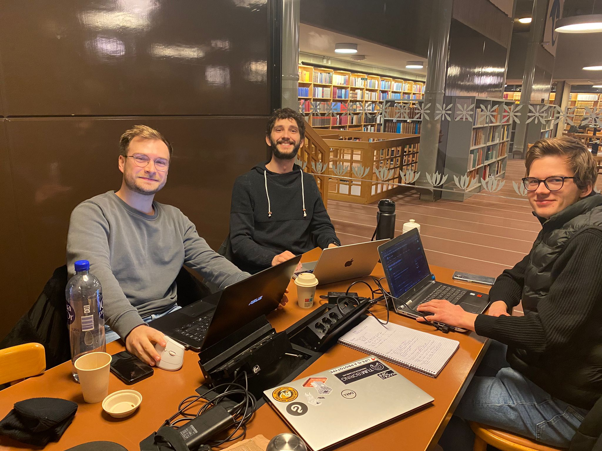

The goal of our first meeting was to create the specification document, which outlines the objectives of our project, alongside the resulting deliverables. We also identified possible future issues and stepping stones.
Lastly we began to structure all tasks into a timeline in order to gain an overview of the project.

In the following parts you can see the result of the specification meeting:
The Elevator Pitch captures the gist of our project in a oneliner.
The Objectives lay out what we want Botender to be able to accomplish when completed.
The Deliverables show the overarching, needed for the completion of the project.
The Potential Issues describe problems that my arise during the project.

### Elevator Pitch

Botender understands the mood of its human customers, engages in conversations based on facial expressions, and recommends the perfect drink for the occasion.

### Objectives

With Botender, we want to create a social robot that can understand and adapt to the mood of the customer and recommend drinks accordingly. This helps give customers the attention they deserve and personal recommendations for drinks, even if it's a busy night. Our concrete objectives are:

1. **Introduction**: Botender will be capable of introducing itself and asking for the customer's name.
2. **Understand the initial mood**: Botender can capture and classify facial expressions of a customer. Botender is capable of detecting at least four different emotions.
3. **React to the initial mood**: Botender can show compassion by reacting to the mood displayed. It will react in a minimum of four different ways.
4. **Give a drink recommendation**: Based on its understanding of the mood and situation, Botender can give recommendations for drinks.
5. **React to the customer's answer**: Botender can react to an answer that the customer gives after the drink recommendation. Botender is capable of differentiating between positive and negative reactions to its recommendation.

Aside from this choreographic interaction, we have the optional goal of making Botender either interact with multiple customers or engage in longer conversations with customers in need of an ear.

### Deliverables

Specific products which need to be delivered upon completion are:

1. A user perception subsystem written in Python that is capable of differentiating between a minimum of four emotions.
2. An interaction subsystem written in Python that uses the user's emotions and speech to hold a small conversation. It contains at least 16 custom gestures to react to a minimum of four different moods. Optionally, it contains a module for integrating OpenAI's language processing capabilities with Furhat to enable an open dialogue.
3. An overall system that contains both subsystems. The corresponding Python script can be executed in the console.
4. A video that shows the use case of interacting with Botender.
5. A report that describes the results and implementation of our project.
6. A blog created with GitHub pages to document the progress of our project.

### Success Metrics

In the following, we explain how we keep track of our progress:

1. **Interaction subsystem**: Is the system capable of asking for and understanding the customer's name?
2. **User perception subsystem**: Number of emotions that can be detected and detection accuracy.
3. **Interaction subsystem**: Number of gestures and reactions implemented for different situations.
4. **Interaction subsystem**: Is the system capable of giving a recommendation for a drink?
5. **Interaction subsystem**: Reliability of the system to understand the intention of responses to the drink recommendation.

### Potential Issues

As with any social robotics projects, potential ethical issues may arise at any point in the project and need to be considered. In addition to the simple task of text-to-speech translation, the system needs to be able to interpret spoken text and extract information, which can pose a technical challenge. Given that the whole interaction depends on the accuracy of the emotion classification of the user, an inaccurate first subsystem might cause problems throughout the whole system. Additionally, inferring the perfect drink for a customer might be difficult based on emotion detection on facial features alone, as the mood might be more nuanced than the system is capable of understanding. Finally, the perfect drink recommendation depends on the personal preferences of the customers.
