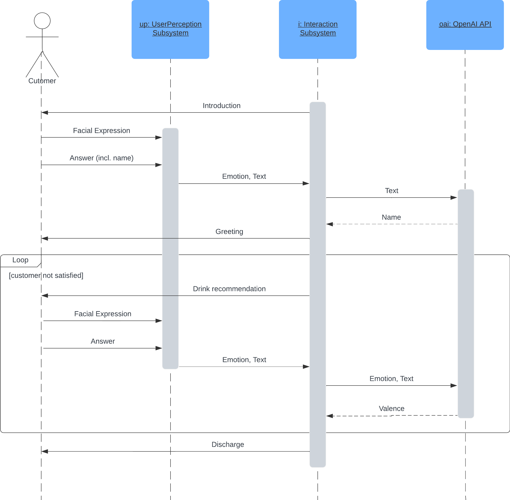
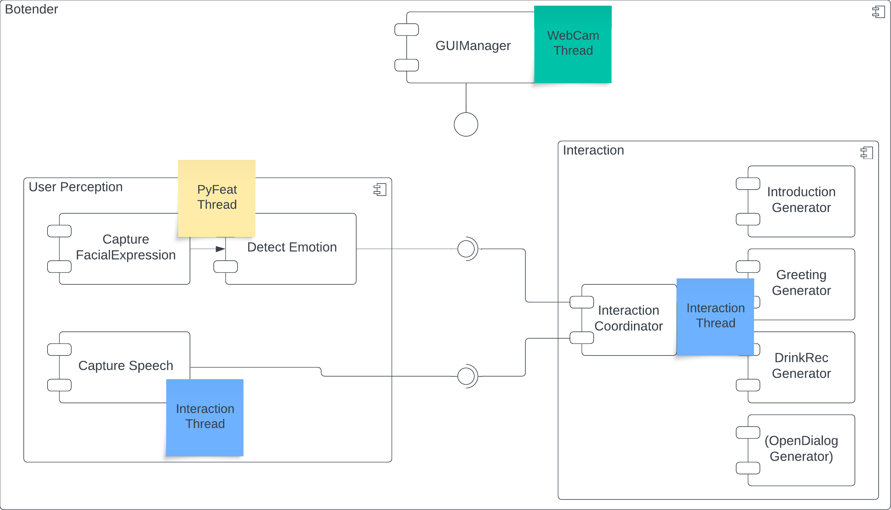
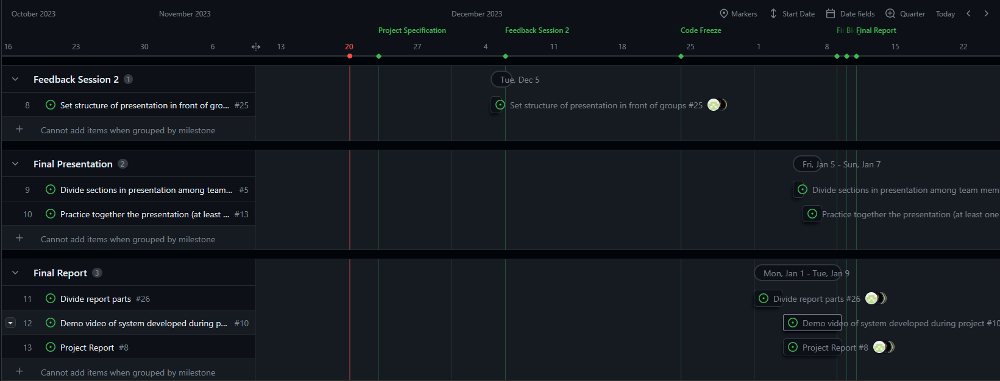

The goal of our second meeting was to define the control flow of our dialogue with Botender and the high-level system architecture. This was required to get a common understanding of our application and define the tasks accordingly.

The following diagram was the result of our brainstorming session and describes the communication between the customer, the two subsystems and the OpenAI API in the initial dialogue:

The dialogue contains three different phases:

1. Botender (Furhat) introduces himself and asks for the name of the customer
2. The customers answers with his name. The user perception subsystems captures additionally the facial expression of the customer and predicts his/her emotion. The user perception subsystem sends the emotion and converted answer to the interaction subsystem. This uses the OpenAI API to extract the name of the customer and greets him/her.
3. Botender recommends a drink based on the assumed mood of the customer. The interaction system gets the emotional and textual reaction to the recommended drink and evaluates if it is positive or negative. Botender recommends drinks until it gets a positive reaction or runs out of recommendations.

Optional, the dialogue can be extended with an open section. The interaction subsystem would then use the OpenAI API to create suitable answers.

After the definition of the control flow, we tried to define a system architecture that can realize the dialogue. We designed it such that it is modular and can be extended easily. The following diagram shows the high-level system architecture as a component diagram:

The Botender system consists of three subsystems:

1. The user perception subsystem contains three components that are responsible for capturing the facial expressions of the customer, using them to predict his/her emotions and capturing the speech of the customer. The components that capture the facial expressions and predicts the emotions are executed in the same thread ("PyFeat Thread"). The capture of the speech is done in a separate thread ("Interaction Thread") and uses the Furhat API to convert the speech to text.
2. The interaction subsystem uses the predicted emotion and the captured answer as input and controls the gestures and texts of Furhat. It runs therefore in the same thread like CaptureSpeech component of the user perception subsystem. The two threads ("PyFeat" and "Interaction Threads") share a global variable that stores the emotion of the customer. The interachtion subsystem contains the InteractionCoordinator component that is responsible for maintaining the dialogue structure. The generator components are capable of generating texts and gestures based on the input of the Interaction subsystem.
3. The GUIManager component is responsible of displaying the WebCam and its overlay. The overlay should contain at least the recognized faces, its predicted emotions and the recommended drink. It can be used for debugging and to make the video that shows a use case better understandable.

After this meeting, we had a common understanding of the control flow and the system architecture. We used this to define the main tasks for the whole project and set deadlines for them. The tasks are organised as GitHub issues and displayed in the project board of our GitHub repository. The following screenshot shows the project board after the meeting:

