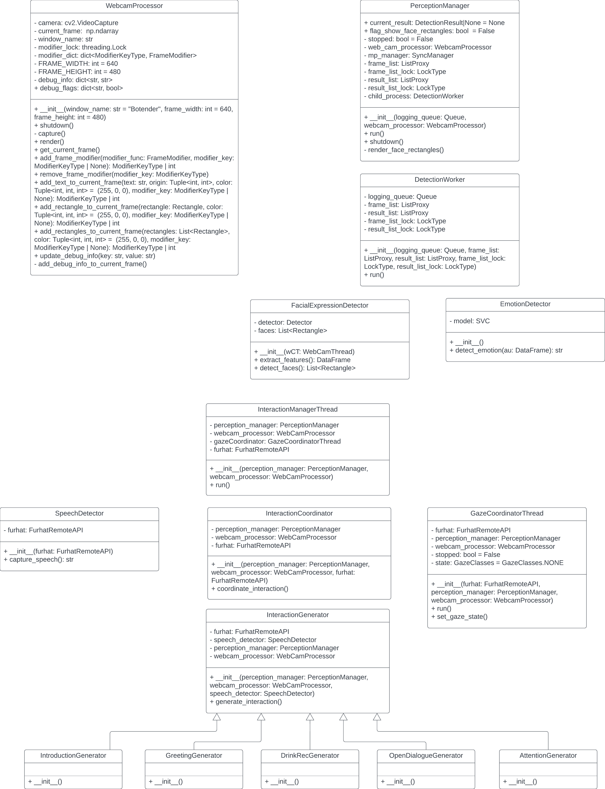

After defining the control flow and the system architecture, we started to implement the Botender framework. The goal of the framework is to encapsulate the different subsystems to be able to develop them independently. The framework should also provide a common interface for the subsystems to communicate with each other.

We started with implementing the structure defined in our system architecture but we had to adapt it during the implementation. The main issue was that only using threads would not work because the detection of faces and other features in images requires a lot of computational power. To get a real speedup, we had to use multiprocessing instead of multithreading for this part of the user perception subsystem due to the different handling of threads and processes by Python. The main disadvantage of multiprocessing is that it is not possible to share global variables between the processes. We solved this issue by using a shared memory object that is provided by the multiprocessing library and controlled by a manager.

We decided to use the following threads and processes in our framework:

- **Main Thread**: The main thread is responsible for starting the other threads and processes. It also contains the main render loop that captures the images from the camera, provides them to the user perception thread and displays the GUI. The GUI (implementend in the WebcamProcesser class) is able to show the captured images, the detected faces and other arbitrary information. The information that should be rendered can be set by the other processes. The main thread also contains the PerceptionManager class that is responsible for starting the detection worker process and inserting the captured frames of the camera into the shared memory.
- **Detection Worker Process**: The detection of faces and other features in the camera frames is executed in a process to achieve the best possible performance. Only one detection worker process is required because we want only the information of the newest camera frame. The DetectionWorker class is responsible for detecting faces and features in the camera frames and storing them in the shared memory. It uses the PyFeat library to detect the features.
- **Interaction Manager Thread**: The InteractionManagerThread class is responsible for detecting when it is required to start an interaction with the customer. It uses the information of the user perception system to detect if a customer is in front of the camera. The interaction and therefore the control of Furhat is executed sequentially in the same thread. It contains also the capturing of the customer's speech and the conversion of the it to text. The basic rule-based dialogue between Furhat and the customer is coordinated by the InteractionCoordinator class. The different parts of the dialogue are created and managed by specific generators. Finally, the InteractionManagerThread class is responsible for starting the GazeCoordinatorThread.
- **Gaze Coordinator Thread**: The GazeCoordinatorThread class is responsible for maintaining the gaze state and the control of Furhat according to it. The gaze state contains the information if Furhat should follow the face of the customer to keep eye contact or if there is no customer in front of the camera which leads to an idle state. This is executed parallel to the sequential interaction and therefore in a separate thread.

The following class diagram shows the structure of the Botender framework including the classes and their attributes and methods:

It describes how the different threads and processes are defined and which attributes and methods they contain to fulfill their tasks.

After implementing and documenting the framework, it should be possible to develop the subsystems independently. It provides still the possibility to be extended with additional features in the future due to its modular structure.
