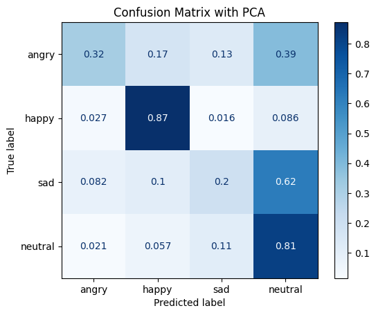

The main part of the user perception component is the prediction of the user's emotion. This is done by a machine learning model that uses the facial expression of the user as input. The model is trained with a dataset of images of faces and the corresponding emotion.

### Data sets
We combined two different datasets for our model training and evaluation process. The first dataset is the [DiffusionFER](https://huggingface.co/datasets/FER-Universe/DiffusionFER) dataset and the second one the [FacialExpression](https://www.kaggle.com/code/myr9988/facial-emotion-recognition-image-classification/input) dataset. We combined the two datasets and selected the images with faces that have the emotion "happy", "angry", "sad" or "neutral". We restricted our model to these four emotions because that are the most important ones in our scenario of a bartender. The final dataset contains 5211 images. We used the **PyFeat** library to extract the action units from the faces in the images. The 20 action units are the features that are used as input for the model.

### Data analysis
The first step of the data analysis was to check the distribution of the emotions in the dataset. We can see that the dataset is almost balanced. The emotion "happy" is the most common one with 36% of the images. The emotion "neutral" is the second most common one with 27% of the images. The emotions "angry" and "sad" are the least common ones with each 18% of the images. The following figure shows the distribution of the emotions in the dataset:

Secondly, we checked the value distributions of the action units in the dataset. The following figure shows the distribution of the action units in the dataset:

We can see that there are no outliers. It is also visible that three of the action units (AU07, AU11 and AU20) have binary values. The others have values between 0 and 1.

We further analyzed the correlation between the action units and the emotion label. The following figure shows the correlation matrix of the action units:

It is visible that the target label is correlated to some of the action units (especially AU06, AU20, AU25 and AU28). This indicates that these action units could be important for the prediction of the emotion. It is also visible that some of the action units are correlated to each other. This indicates that these action units could be redundant and could be removed from the dataset. Examples for correlated action units are AU06 and AU12, AU06 and AU09 and AU10 and AU12.

### Data preprocessing
After the data analysis, we preprocessed the data. To clean the dataset, we removed the duplicates and samples with missing values. We split the remaining 5180 samples into a training set (90%) and a test set (10%). We scaled the feature columns with a standard scaler. As a consequence of the correlation analysis, we applied a PCA to the feature columns to reduce the dimensionality of the dataset. We reduced the dimensionality to 9 components. To compare this dataset with the original dataset, we also trained a model with the original dataset without the PCA.

### Model training

To find the best model and its best hyperparameters for our scenario, we performed a grid search of sklearn with cross validation. We used a RandomForestClassifier and a Support Vector Machine (SVM) from sklearn as models. We performed a seperate grid search for the original dataset and the dataset with PCA. Both grid searches resulted in the same best model and hyperparameters. The best model is a RandomForestClassifier with 100 estimators and a maximum depth of 10. After the grid search, we trained the best model with the whole training set and saved it for the evaluation and predictions in our user perception subsystem.

### Model evaluation

After the training of the models, we evaluated them with the test set. The following table shows the results of the evaluation of the models and different datasets:

| Dataset              | F1 score | Accuracy |
|----------------------|----------|----------|
| Training with PCA    | 81.63%   | 83.83%   |
| Test without PCA     | 53.88%   | 62.74%   |
| Training without PCA | 84.42%   | 86.38%   |
| Test without PCA     | 53.99%   | 63.32%   |

We can see that the models trained with or without the PCA have almost the same performance. The model trained with the PCA has a slightly lower F1 score and accuracy. The models tend to overfit the training data because they achieve a F1 score and accuracy of over 80% on the training data but only scores of around 60% on the test data.

The confusion matrices in the following figures show the prediction accuracies for each emotion on the test data:

It can be seen that the models are able to predict the emotion "happy" and "neutral" well. The emotion "angry" is predicted with a lower accuracy. The emotion "sad" is predicted very poorly and it seems difficult to distinguish it from the emotion "neutral".

### Neural network

To compare the performance of the sklearn models with a neural network, we implemented a simple linear classifier as a neural network with PyTorch. The neural network has the same input and output as the sklearn models. The neural network has four hidden layers with 45 neurons each. We trained the neural network over 100 epochs with the same training and test data as the sklearn models.

The following figures show the loss and accuracy of the neural network during the training:

We can see that the models learns to reduce the loss and the accuracy increases during the training.

The following table shows the results of the evaluation of the neural network:

| Dataset              | Accuracy |
|----------------------|----------|
| Training with PCA    |   62%    |
| Test without PCA     |   43%    |
| Training without PCA |   64%    |
| Test without PCA     |   45%    |

We can see that the neural network has a lower accuracy than the sklearn models. The neural network also tends to overfit the training data because it achieves a higher accuracy on the training data than on the test data.

### Conclusion

The evaluation of our models indicates that it is not possible to predict the emotion of the user with a high accuracy. The models tend to overfit the training data and the accuracy on the test data is around 60%. Implementing a simple neural network does not improve the accuracy. The reason of the low accuracies could be that the action units are not sufficient to predict the emotion of a face.

To overcome this problem, we could train a convolution neural network (CNN) with the images of the faces as input. The CNN could learn the features of the faces itself and could be able to predict the emotion better. Another possibility would be to use a pretrained CNN and to train only the last layers with our dataset. This could be done with transfer learning. But these two approaches are not in the scope of our project.