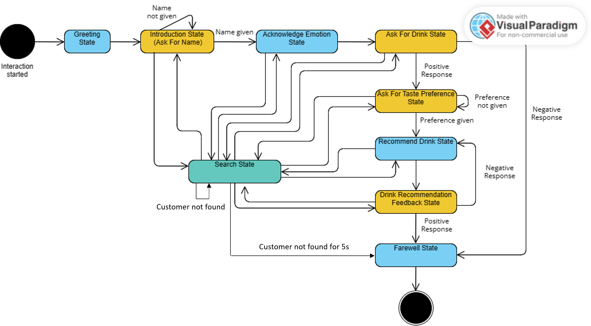

Botender's behavior  is adapted in real-time to respond appropriately to the user's emotions and the context of the interaction. The Interaction Component integrates perception data with a state machine approach.

## Components and their functionality

- The **InteractionManager** Thread starts and manages the interactions. It waits for a face to be detected by the *Perception Manager* . When a face is detected and present for a specified duration (more than 150 consecutive frames), the thread starts an interaction by creating an instance of the InteractionCoordinator.

- The **GazeCoordinator** Thread manages Botender's gaze, ensuring it follows the customer or adopts an idle state when no interaction is taking place. By utilizing frame dimensions and perception data, it determines where Botender should look. That is how a more engaging interaction is created.

- The **InteractionCoordinator** follows the state design pattern. It manages different states. Each state encapsulates specific behaviors and responses. The transitions between states are based on user input, perceived emotions, and interaction progress.

## State Machine Dynamics
The *Interaction Manager* utilizes a FSM to manage the flow of interaction between Botender and the customer. It monitors whether the user is present in the frame. If the user leaves the frame, it is detected as an event, triggering the FSM to reset to its initial state: the `Greeting state`.Thus, a consistens experience is provided since the interaction starts from the beginning.

The use of a FSM allows for a rule-based conversation flow with Botender. Hence, the FSM provides a predictable flow of interaction, where each state can be developed and tested independently. This enhances maintainability.

The states are listed below:
- The `Greeting State`: It initiates the interaction with a welcoming message. Botender greets the user using pre-defined phrases and gestures. After the greeting is completed, the FSM transitions to the Introduction State.
- The `Introduction State`: This state involves listening to the user's response and extracting the user's name using natural language processing techniques. It handles the introduction of the user to the robot. It transitions to the `Acknowledge Introduction State` when the user's name is extracted. Otherwise, it remains in the `Introduction State` and asks the user to repeat their name.
- The `Acknowledge Emotion State`: This state acknowledges the user's current emotional state as determined by the User Perception subsystem. It responds with appropriate gestures and comments based on the perceived emotion. To conclude the interaction, it leads to the Farewell State.
- The `Ask For Drink State`: This state asks the user if they would like to order a drink. It transitions to the `Ask For Drink Preference State` if the user responds positively. Otherwise, it transitions to the `Farewell State`.
- The `Ask For Drink Preference State`: This state asks the user to specify their drink preference by choosing from a list of four taste options: sweet, sour, strong and milk-based. It transitions to the `Recommend Drink State` as soon as it gets the preference.
- The `Recommend Drink State`: This state recommends a drink based on the user's preference and emotion. It transitions to the `Drink Recommendation Feedback State`.
- `Drink Recommendation Feedback State`: This state asks the user if they like the recommended drink. It transitions to the `Farewell State` if the user responds positively. Otherwise, it transitions to the `Drink Recommendation State` and suggests a different drink.
- The `Farewell State`: The final state which concludes the interaction. Botender bids farewell to the user with a friendly and positive gesture.
- The `Search State`: Represents a scenario where Botender actively looks for the customer or awaits a new customer's arrival. The robot exhibits gestures indicating it's searching for interaction. If the customer is detected, the FSM transitions to the previous state. Otherwise, it remains in the Search State. If the customer doesn't arrive within a specified time, the FSM transitions to the Farewell State.

The following diagram illustrates the state machine:

We implemented the FSM as a abstract state class that contains the method **handle**. This method is called by the InteractionCoordinator to execute the current state. To define a new state, the developer has to create a new class that inherits from the abstract state class and implements the **handle** method. Transitions can be made by calling the **transition** method of the InteractionCoordinator. This allows us to easily extend the FSM with new states and transitions or define a totally different FSM for a different use case.

